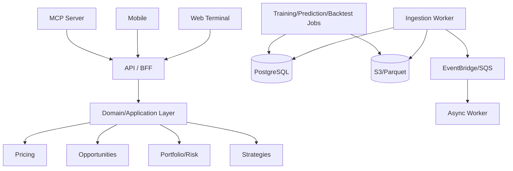

# Technical Design Document

**Product:** Multi-Sport Quantitative Betting & Trading Platform  
**Version:** 0.2  
**Status:** Draft  
**Related:** `docs/product/PRD.md`

---

## 1. Architecture Summary

The platform will use a **polyglot monorepo** with a small number of independently deployable applications and strong internal module boundaries.

Primary planes:

- **Data:** provider ingestion, raw history, canonical sports/market data, features, model artifacts
- **Decision:** modeling, pricing, strategies, opportunities, backtesting, portfolio/risk
- **Experience:** API/BFF, MCP, web, mobile, alerts, eventual execution

V1 should favor a **modular monolith plus asynchronous workers/jobs** over a large microservice estate.

## 2. Architecture Principles

1. Price, not picks.
2. Model underlying outcomes, then price markets.
3. Provider schemas stop at adapter boundaries.
4. Data source and venue are separate concepts.
5. BFF owns no authoritative business data.
6. Critical calculations are deterministic.
7. Backtesting preserves event-time semantics.
8. Async consumers are idempotent and assume at-least-once delivery.
9. Local/CI validation should not require paid APIs or AWS credentials.
10. Deployable boundaries are earned by scaling/security/ownership needs, not created preemptively.

## 3. High-Level Architecture



## 4. Repository Strategy

### Decision

Use a polyglot monorepo.

### Proposed layout

```text
apps/
  web/
  mobile/
  api/
  mcp/
workers/
  ingestion/
  events/
  predictions/
  backtests/
  training/
libs/
  python/
    domain/
    pricing/
    strategies/
    risk/
    portfolio/
    backtesting/
  typescript/
    api-client/
    ui-tokens/
    formatting/
sports/
  soccer/
  basketball/
  american-football/
  tennis/
contracts/
infra/cdk/
docs/
scripts/
```

TypeScript owns client applications, CDK, and MCP integration where useful. Python owns modeling, analytical pipelines, backtesting, and the primary API/domain implementation where appropriate. Shared interoperability is through explicit contracts, not cross-language imports.

## 5. Initial Deployables

- Static web application
- Mobile application
- API/BFF
- MCP server
- Async worker
- One-off training/prediction/backtest tasks

Logical domains remain separable even when deployed together.

## 6. Web

Recommended V1: React + TypeScript + Vite, TanStack Query/Table/Router, generated API client, static deployment to S3/CloudFront.

SSR is not required for the authenticated analytical terminal.

## 7. Mobile

Recommended V1: Expo + React Native + TypeScript, Expo Router, TanStack Query, generated API client, secure native authentication storage, push notifications, and deep links.

Share contracts, formatting, analytics conventions, and design tokens. Do not force dense desktop terminal components to be reused on mobile.

## 8. API/BFF

Recommended V1: Python + FastAPI.

Responsibilities:

- Authn/authz
- Validation
- Client-oriented aggregation
- Pagination
- Partial-failure handling
- API versioning

The BFF owns no authoritative domain data.

## 9. Contracts

OpenAPI is the external request/response contract. Generate TypeScript clients and verify generated output in CI. Default compatibility rule: additive changes only.

Domain events use versioned schemas under `contracts/events/`.

## 10. Canonical Domain

Core entities:

`Sport`, `Competition`, `Season`, `Participant`, `Event`, `EventParticipant`, `Market`, `Selection`, `Venue`, `DataSource`, `Quote`, `MarketSnapshot`, `Prediction`, `ModelVersion`, `Strategy`, `BacktestRun`, `Portfolio`, `Position`, `Order`, `Execution`, `Settlement`, `Alert`, `Watchlist`, `ProviderEntityMapping`.

See `canonical-domain-model.md`.

## 11. DataSource vs Venue

**DataSource** answers: *Where did this data come from?*

**Venue** answers: *Where is this market/price offered or tradable?*

Examples:

| Venue | Data source |
|---|---|
| Bovada | The Odds API |
| Pinnacle | The Odds API |
| Kalshi | Kalshi API |
| Polymarket | Polymarket API |

This separation is mandatory for provenance, provider substitution, and future execution.

## 12. V1 Provider Strategy

Provisional V1 sources:

- **Sportmonks:** structured soccer fundamentals/statistics and selected advanced data
- **The Odds API:** sportsbook market aggregation/current prices; paid historical only when justified
- **Kalshi:** market data/order books and official demo execution path; future real execution
- **Polymarket:** market data/order books where supported; fixture/paper testing until a suitable execution test environment is available
- **Football-Data.co.uk:** free historical soccer bootstrap datasets for research/backtests

Later candidates:

- SportsDataIO
- Sportradar

Vendor-specific prices/quotas belong in `docs/data/provider-evaluation.md`, not here.

## 13. Free-Tier-First Validation

Normal local development and CI must not require paid external API calls.

Testing modes:

1. Unit tests — network disabled.
2. Fixture/provider-emulator tests — captured real-shaped payloads.
3. Contract tests — small calls to free/demo/replay provider environments.
4. Production-feed validation — paid/real provider access only when required.

Historical data purchased or retrieved from a paid endpoint should be retained in raw immutable storage and reused where licensing permits.

## 14. Local AWS Emulation

Use **Floci** as the standard local AWS emulator.

Local environment:

```text
PostgreSQL
Floci
Mock provider server
API
Worker
```

Floci is for AWS-shaped services. External sports/market providers are represented by fixtures/mock servers, not by Floci.

`cdk synth` remains credential-free and independent of emulator availability.

## 15. Storage

### PostgreSQL

Use for canonical transactional/current state: users, events, markets, current quotes, predictions, strategies, portfolio, positions, alerts, provider mappings, backtest metadata, and audit metadata.

### S3 + Parquet

Use for raw provider payloads, historical odds/order books, normalized historical datasets, features, model artifacts, training datasets, backtest artifacts, and simulation outputs.

### DuckDB

Use for local/ad-hoc analytical reads over Parquet where useful.

Do not add Redis or OpenSearch until measured workload justifies them.

## 16. Ingestion

```text
Provider -> Raw immutable payload -> Schema validation -> Entity resolution -> Canonical normalization -> Current state + historical store -> Domain event
```

Every normalized record keeps source provenance and provider-native identifiers.

## 17. Event-Time Semantics

Research-sensitive records should support:

- `effective_at`
- `observed_at`
- `available_at`
- `ingested_at`

Backtests query `available_at <= simulated_decision_time`.

Apply that invariant to every consumed feature, quote, mapping/context dependency
and training label as appropriate to its fit/decision cutoff. Conceptual
`features.as_of(decision_time)` / `quotes.as_of(decision_time)` cannot read current
state or backfill unknown availability. Outcome labels are separate later
evaluation data. Frozen replay alone does not establish historical eligibility;
ADR-026/029/034/035 restrictions remain unchanged.

## 18. Entity Resolution

Maintain explicit provider-to-canonical mappings with confidence and validation metadata. Ambiguous mappings go to review rather than silent fuzzy matching in production logic.

## 19. Market Normalization

Provider labels must map to canonical market definitions. Provider-specific market strings do not propagate past adapters.

## 20. Modeling Interface

Sport plugins expose conceptual interfaces for feature building, model training, prediction, outcome distributions, sport-specific market pricing, and evaluation.

Initial soccer output is a joint score distribution.

## 21. Soccer Baseline

Follow [ADR-008](../adr/ADR-008-soccer-baseline-model.md): no-vig market benchmark,
Elo/simple strength, independent Poisson, Dixon-Coles, then dynamic/bivariate,
xG-enhanced and richer statistical challengers. Probability-producing ML,
market-aware challengers and calibrated ensembles follow strong baselines.
Complexity earns promotion through repeatable chronological OOS improvement
against both simpler models and the same-horizon market baseline, not in-sample
fit or win rate. Experiments may fail without promotion.

xG/xGA and shot quality are high-priority where rights, coverage and availability
permit; eligible goals/results data can establish the first baseline without xG.
Recency windows, decay and dynamic latent strength are competition-aware empirical
choices tuned on earlier folds, never a universal constant. Direct market
probability challengers do not automatically supply joint score distributions.

## 22. Model Registry

Track model version, sport/competition scope, training interval, feature schema, dataset version, artifact URI, calibration metrics, OOS metrics, and status (`CANDIDATE`, `SHADOW`, `ACTIVE`, `RETIRED`).

Model artifacts live in S3; metadata lives in PostgreSQL.

Also retain model family/input dependencies (independent fundamentals versus
market-aware, including ensembles), training cutoff/readiness, calibration and
uncertainty method versions, supported horizons, benchmark snapshot/policy pins,
paired OOS metrics, excluded cohorts and promotion evidence. No ML library is
selected. These remain conceptual Phase 4 contracts, not existing storage fields.

## 23. Prediction Architecture

Pregame inference is batch/job-oriented in V1. Upcoming event or data changes schedule prediction refresh. The request path reads persisted predictions rather than performing model inference.

Reuse Prediction as the immutable forecast snapshot, with a versioned
ForecastHorizon policy, actual decision time, generation time and kickoff context.
OPEN/T_MINUS_24H/T_MINUS_6H/T_MINUS_60M/LATEST_PREMATCH are illustrative labels;
cutoffs, tolerances, missing windows and rescheduling rules must be explicit.
Historical simulation generated today is labelled separately from then-published
forecasts. Attach ModelUncertainty evidence; do not confuse probability with
reliability or silently manufacture unavailable uncertainty estimates.

## 24. Pricing Engine

Deterministic function:

`OutcomeDistribution + MarketDefinition -> FairProbability + FairOdds`

Support explicit vig-removal methods with method/version recorded in results.

Candidate methods include MULTIPLICATIVE, SHIN and POWER. Retain parameters,
numeric/failure policy and input pins. A derived MarketConsensusSnapshot aggregates
compatible, complete, contemporaneous venue outcome sets under a versioned policy;
retain source/venue deduplication, freshness, exclusions, coverage and method
sensitivity. Consensus is not an executable quote. Implement the narrow research
benchmark in Phase 4, then reuse it in Phase 5; no duplicate pricing business logic.

## 25. Opportunity Engine

Combine model fair probability, executable/current market price, no-vig market probability, edge, EV, quote freshness, prediction freshness, and strategy filters.

Distinguish raw estimated EV from reliability and actionable strategy qualification.
EV uses the probability and offered executable price with applicable fees/slippage
and settlement assumptions; model uncertainty and market/de-vig uncertainty inform
qualification/abstention, not an invented EV adjustment term. No fixed universal
threshold or confidence-adjusted formula is chosen. ADR-034/035 observations alone
are not executable-price evidence.

For exchange-style venues, prioritize bid/ask/depth over a decorative midpoint.

## 26. Strategy Engine

One deterministic implementation must be reusable across backtest, scanner, paper, and future execution paths.

## 27. Backtesting

Backtests run against versioned historical datasets and a simulated clock. Never read present-state data as historical truth.

Large backtests run asynchronously on one-off containers and persist summary metadata to PostgreSQL plus artifacts to S3.

[ADR-036](../adr/ADR-036-soccer-model-evaluation-and-market-benchmarking.md) defines
chronological fitting/calibration/tuning and untouched OOS comparison. Primary
metrics are log loss, Brier and calibration/reliability with paired deltas against
simple and market baselines. Report EV, CLV, realized ROI/P&L, drawdown, volatility
and sample size separately. Segment by league, season, horizon, market, odds bucket
and selection type; add dependence-aware uncertainty intervals as research matures.
Positive CLV is diagnostic, not proof of sustainable profit. Pin closing-price
conventions and keep closing observations out of earlier decision inputs.

## 28. Portfolio and Risk

Use append-only ledger concepts for cash-affecting state. Risk checks are centralized and cannot be bypassed by the agent or execution adapters.

Fractional Kelly is a future sizing research benchmark, not an automatic production
default; full Kelly is not the default. Any such sizing is constrained by position,
event, participant and correlated exposure, bankroll-at-risk, daily/weekly loss
limits and confidence/model quality. This design adds no implemented risk behavior.

## 29. Execution Abstraction

`ExecutionAdapter` starts with paper trading. Venue-specific real implementations arrive later.

Prediction-market integrations may provide both `MarketDataAdapter` and `ExecutionAdapter` capabilities.

## 30. Parlays

Independent cross-event selections may use multiplication where justified. Same-event/correlated legs use sport-specific joint distributions, simulation, or another validated joint-probability method. Same-event legs must never silently fall back to independence when material dependency is unknown.

Parlay evaluation is an authoritative deterministic backend domain capability. UI and agent layers consume a structured `ParlayEvaluation`; they do not independently calculate fair joint probability, EV, correlation-sensitive pricing, risk, or counterfactual results.

For soccer score-derived same-game legs, prefer exact joint score-matrix
enumeration when all settlement predicates are covered; retain support/tail policy.
Expose EXACT, SIMULATED, INDEPENDENCE_ASSUMED or UNSUPPORTED joint-model coverage
separately from ModelUncertainty, including mixed dependency-group assumptions.
Simulation retains version/seed/count and sampling error. No validated joint model
means unavailable authoritative joint probability/EV, not an invented adjustment
by the backend or LLM. Direct marginal ML predictions cannot fill this gap.

The domain capability should support, where available:

- offered odds and break-even probability;
- fair joint probability and fair odds;
- expected value;
- correlation method/version and unsupported-correlation warnings;
- model confidence/freshness;
- per-leg standalone value and incremental impact;
- single-leg-removal counterfactuals;
- straight-position comparison;
- price-sensitivity thresholds.

Conceptual domain outputs include `ParlayEvaluation` and `ParlayLegEvaluation`. Exact schemas belong in the domain/API contracts and must preserve model versions, pricing versions, timestamps, venue/data-source provenance, and simulation configuration/seed where required for reproducibility.

The agent-facing `evaluate_parlay` tool must call this authoritative backend capability and may explain its structured result, but the LLM is not authoritative for the calculations. Detailed product behavior is defined in [`../product/feature-specs/parlay-lab.md`](../product/feature-specs/parlay-lab.md).

## 31. Alerts

Domain events such as `QuoteUpdated` and `PredictionUpdated` trigger opportunity recalculation and declarative alert evaluation. Mobile push deep-links to the relevant event/market/position.

## 32. Domain Events

Use EventBridge plus per-consumer SQS queues/DLQs. Assume at-least-once delivery. Include `event_id`, `event_type`, `version`, `occurred_at`, `published_at`, `correlation_id`, and `causation_id`.

## 33. MCP

MCP is an orchestration adapter over authoritative platform APIs, not a second business-logic implementation.

Initial namespaces: `sports`, `markets`, `research`, `strategies`, `portfolio`, `watchlists`, `alerts`, `paper`.

## 34. Authentication and Authorization

AWS-first recommendation: Cognito/OIDC. Execution credentials remain server-side. Future execution receives stronger scopes than research/paper operations.

## 35. Real-Time Delivery

WebSocket/SSE may provide incremental updates for quotes, predictions, opportunities, positions, and alerts. Basic correctness cannot depend on a persistent socket.

## 36. Infrastructure

AWS CDK in TypeScript. Likely resources: S3, CloudFront, RDS PostgreSQL, ECS/Fargate/ECR, EventBridge, SQS/DLQ, Cognito, Secrets Manager/KMS, CloudWatch/OpenTelemetry, and Step Functions where orchestration earns its complexity.

## 37. Observability

Structured logs and traces include request/correlation IDs and relevant event/provider/model/strategy identifiers. Track provider freshness, normalization failures, queue/DLQ state, model/calibration drift, backtest failures, alert delay, and provider quota usage.

## 38. Provider Cost/Quota Telemetry

Track per provider/environment:

- Request count
- Provider-specific quota units
- Remaining quota where exposed
- Estimated cost
- Cache/hit/reuse metrics
- Contract-test usage

Dev should alert before exhausting free quotas.

## 39. Security

TLS, encryption at rest, least-privilege IAM, private DB networking, secrets server-side, input validation, audit logs, dependency scanning, and no provider/execution secrets in clients.

## 40. CI/CD

Pipeline:

`install -> generated-drift -> format -> lint -> typecheck -> unit -> contract compatibility -> local integration -> CDK synth -> security scan -> build`

Production deployment requires explicit approval.

## 41. Canonical Root Commands

- `scripts/bootstrap`
- `scripts/build`
- `scripts/local-up`
- `scripts/local-down`
- `scripts/test-unit`
- `scripts/test-integration`
- `scripts/test-provider-contracts`
- `scripts/lint`
- `scripts/typecheck`
- `scripts/format-check`
- `scripts/validate`
- `scripts/synth`

## 42. Agent-Ready Repository

Root `AGENTS.md` is canonical. `CLAUDE.md` should contain `@AGENTS.md`. Nested agent instructions exist only where package-level commands/safety materially differ (for example `infra/cdk`, generated contracts, or mobile).

## 43. Service Extraction Criteria

Extract a logical module into an independent service only for independent scaling, security isolation, release lifecycle, availability, runtime needs, failure isolation, or separate ownership.

## 44. Implementation Order

Foundation → domain/contracts → local environment → provider adapters → soccer ingestion → model → pricing → backtester → paper portfolio/risk → opportunity engine → API/MCP → web → mobile → parlays → additional sports → controlled execution.

## 45. Technical Foundation Definition of Done

- Monorepo bootstraps with one command
- Web/mobile/API/MCP build locally
- PostgreSQL and Floci start locally
- Provider mock server and fixtures exist
- OpenAPI/client generation works
- Generated-drift check exists
- Event envelope/idempotency/DLQ tests exist
- CDK synth works without AWS credentials
- `scripts/validate` works
- Root `AGENTS.md`/`CLAUDE.md` exist
- Correlation IDs and structured logs work
- Normal local/CI path uses $0 paid provider calls
- Provider contract tests are separately classified and quota-limited

## 46. Deferred Decisions

- Final production provider portfolio by sport
- RDS vs Aurora migration timing
- Redis/OpenSearch need
- SageMaker/AWS Batch need
- Advanced model families
- Live-data provider
- First real-money venue
- Commercial licensing terms
